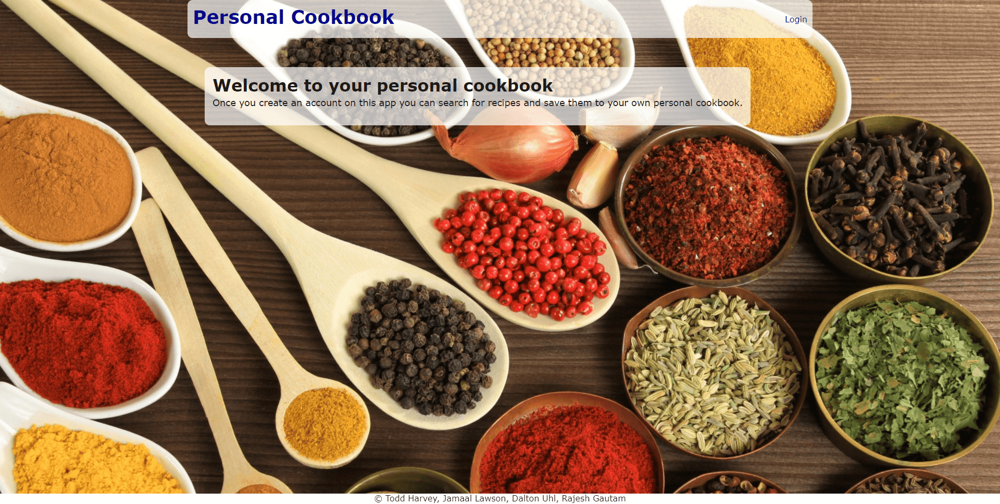
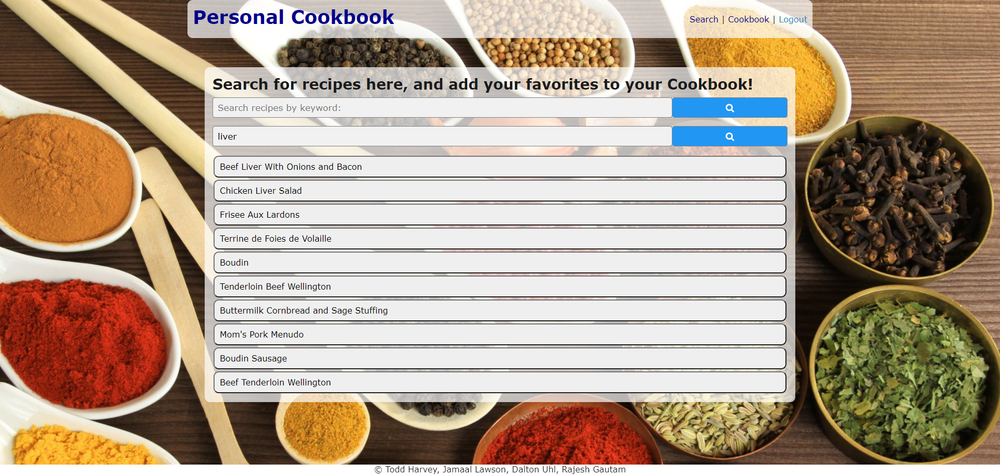
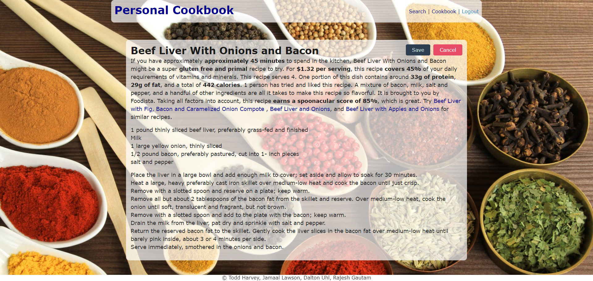
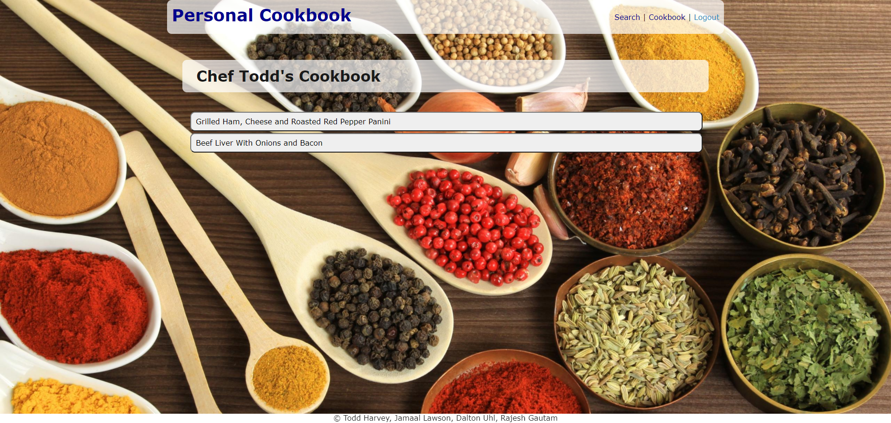
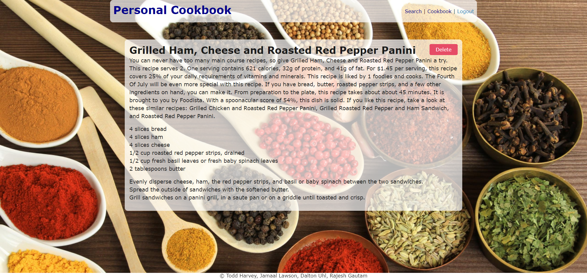
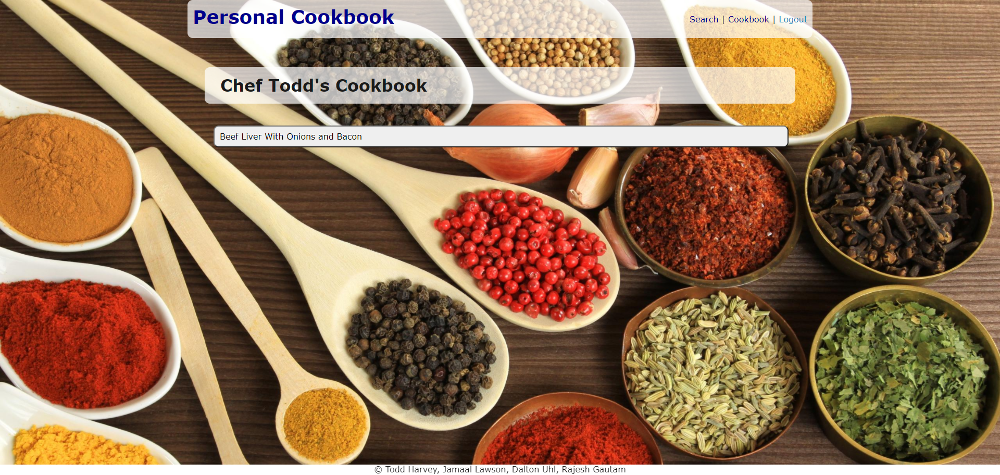

# Personal Cookbook

## Description
This is the second JHU Bootcamp team project collaboration, focused on: html, css, javascript, node.js, Express, SQL, use of a database, and responsive web design. The title of our innovative project idea is Personal Cookbook. It is an application that allows a user to search any kind of recipes of his/her choice. This app will run in the browser and feature dynamically updated files. This application emphasizes the use of server-side APIs, to get information from commercially-available sources and interact with user input data to generate the new dishes name, ingridients, and save it for the future overview.

## Feature List:
- MySQL: Relational database management system based on SQL – Structured Query Language, used in this applicationt to warehouse and query employee and company data.
- Express.js - Used for application set up of middle ware for end point connection between the front end and backend.
- Node.js - Used for package managment and to execute JavaScript code to build command line tool for server-side scripting.
- Javascript - Used to base functionality of functions and prompts within the application.
- Git - Version control system to track changes to source code
- GitHub - Hosts repository that can be deployed to GitHub Pages

* User can search recipes for all kind of dishes.
* User can login and create own profile and save the recipes list.

## Built with:

- [MySQL](https://developer.mozilla.org/en-US/docs/Glossary/SQL)
- [Express.js](https://developer.mozilla.org/en-US/docs/Learn/Server-side/Express_Nodejs)
- [Node.js](https://developer.mozilla.org/en-US/docs/Glossary/Node.js?retiredLocale=hu)

#### APIs list:
* [Spoonacular](https://spoonacular.com/food-api)

Each individual can sign in and create own profile to make the collection of recipes. The Sql storage is used here to store previous searched and saved recipes. For a convenient and clear look, we have made the UI simple and attractive with appropriate css style. 

## Screenshots

Landing page:

Login / Sign Up page:

Personal recipe list page:

Search page:

Selected recipe with option to save:

Personal recipe list showing new recipe added:

Viewing a recipe from personal list with option to delete:

Personal recipe list after recipe deleted:

## Links :

* Link for the deployed application: [Personal Cookbook](https://tranquil-springs-98499.herokuapp.com/)
* Link for the Github repository: [Github](https://github.com/tharveyster/recipe-search)

## Contributors:
* [Todd Harvey](https://github.com/tharveyster)
* [Dalton Uhil](https://github.com/duhl91)
* [Jamaal Lawson](https://github.com/Maalie04)
* [Rajesh Gautam](https://github.com/Rajesh295-dev)

- - -
